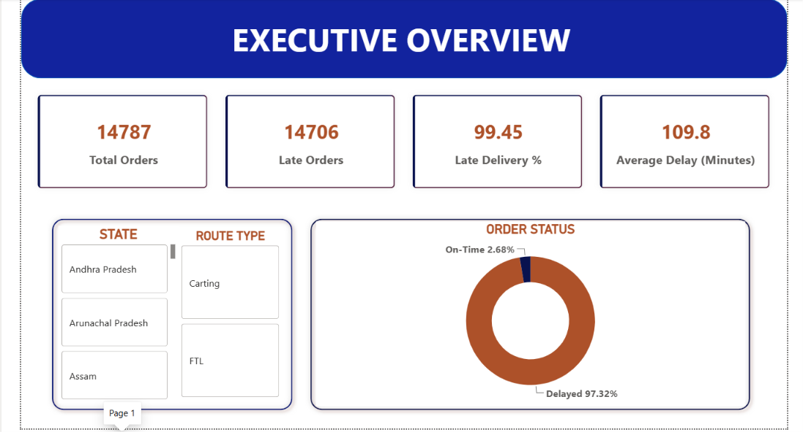
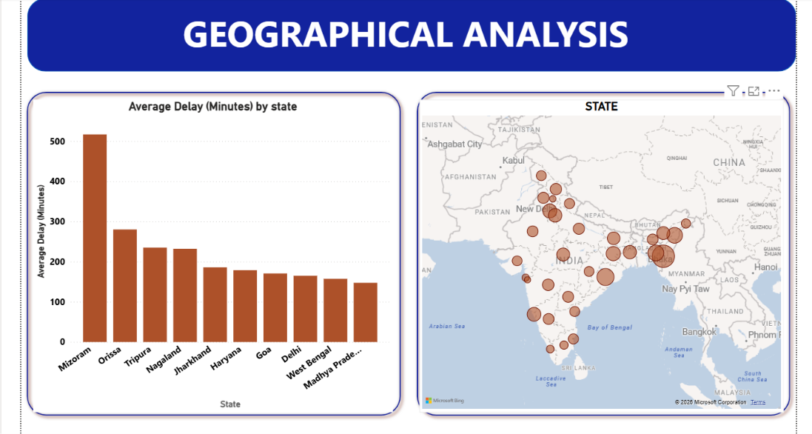
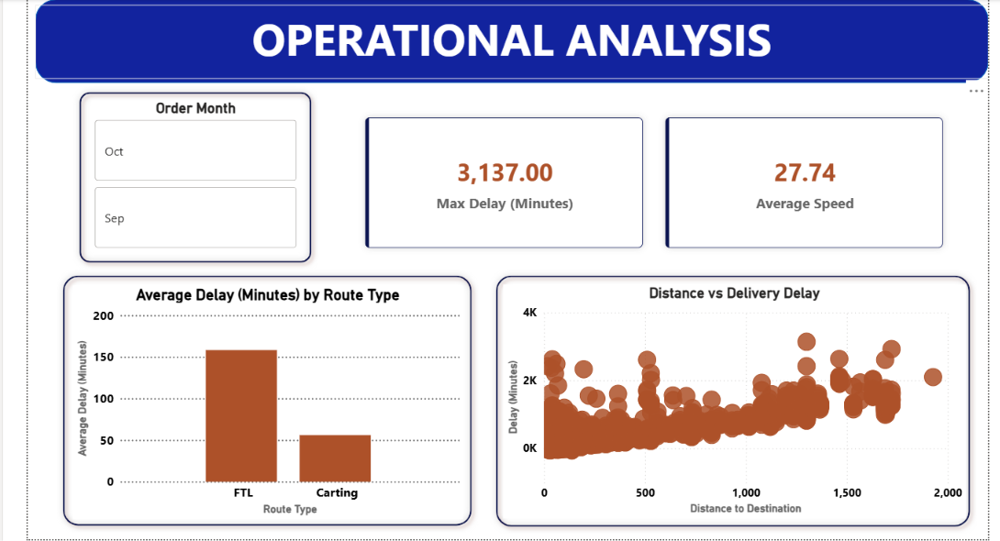

#  Delhivery Logistics Performance & Supply Chain Analytics

> End-to-end analysis of **26,300+ delivery trips** to uncover *why* shipments are late — and where to fix it first.
> Python for cleaning → PostgreSQL for business querying → Power BI for a 3-page executive dashboard.
---

##  Project Overview

Delhivery is one of India's largest logistics companies. This project analyzes **26,300+ real delivery trips** to identify *where* and *why* the operation loses time — comparing actual travel duration against OSRM-estimated times, flagging high-delay "Red Zone" states, and quantifying the impact of route type and distance on delivery performance.

The goal wasn't just to describe the data — it was to answer the questions an operations manager would actually ask.

##  Problem Statement

> Which trips are late, why are they late, and what should the operations team fix first?

Specifically: compare actual vs. OSRM-estimated travel time, identify high-delay states, and determine whether delays are driven more by route type, distance, seller handoff, or carrier transit.

---

##  Dashboard Preview

---

##  Tech Stack

| Stage | Tool | Purpose |
|---|---|---|
| Data Cleaning | Python (Pandas) | Handling missing values, outliers, type conversions |
| Business Querying | PostgreSQL | 10 business-critical SQL queries |
| Visualization | Power BI | 3-page interactive executive dashboard |

---

##  Repository Contents

| File | Description |
|---|---|
| `logistics.ipynb` | Python notebook — data cleaning & preprocessing |
| `delhivery_data_cleaned.xlsx` | Cleaned dataset output, ready for SQL/BI use |
| `Logistics_analysis.sql` | All 10 business-question SQL queries |
| `logistics_analysis_dashboard.pbix` | The 3-page Power BI dashboard file |
| `logistics_analysis_output/` | Exported results/visuals from the analysis |

---

## SQL Analysis — 10 Business Questions Answered

Queries run against the `logistics` database in `Logistics_analysis.sql`:

1. **Overall Delay Rate (KPI):** What percentage of total orders are delivered late?
2. **Red Zones:** Which states have the highest average delivery delay?
3. **Operational Bottlenecks:** Which route types (FTL vs. Carting) contribute most to delays?
4. **Root Cause:** Are delays caused more by sellers or by carriers?
5. **Inefficiency Detection:** Which locations miss commitments despite short distances (<100km)?
6. **Distance vs. Delay:** Does delivery distance directly impact delay duration?
7. **Speed Efficiency:** How does average transport speed correlate with delays?
8. **Reliability KPI:** How does the Efficiency Ratio impact delivery commitments?
9. **Route-Level Analysis:** Which specific source→destination routes are most problematic?
10. **Critical Cases:** Top 10 worst-performing deliveries requiring immediate action.

---

## Dashboard Structure

**Page 1 — Executive Summary**
High-level KPIs (Total Trips, Avg. Delay Minutes, Overall Efficiency Ratio), on-time vs. late breakdown, and a state-wise delay-intensity map of India.

**Page 2 — Efficiency & Speed Analysis**
FTL vs. Carting route-type comparison, short-vs-long-haul distance impact, and speed-bucket analysis to find the sweet spot that minimizes delay.

**Page 3 — Route & Bottleneck Deep-Dive**
Top 10 problematic routes, trips categorized into High/Medium/Low efficiency, and a seller-vs-carrier delay-contribution breakdown.

---

##  Key Insights & Recommendations

- **Red Zones:** Maharashtra and Uttar Pradesh show the highest average delivery delays — **recommend prioritizing these states for infrastructure or routing review.**
- **Carrier vs. Seller:** The majority of delay time accumulates during the *carrier transit phase*, not at the seller handoff — **recommend auditing carrier route planning before addressing seller-side processes.**
- **Efficiency Threshold:** Trips with an Efficiency Ratio below **0.8** consistently miss delivery deadlines — **recommend using 0.8 as an early-warning threshold to flag at-risk shipments before they're late.**

---

## How to Reproduce This Analysis

1. **Data Cleaning:** Open `logistics.ipynb` to see the full Python cleaning pipeline (missing values, outlier handling, feature prep).
2. **SQL Queries:** Run the queries in `Logistics_analysis.sql` against a PostgreSQL instance loaded with the cleaned dataset.
3. **Dashboard:** Open `logistics_analysis_dashboard.pbix` in Power BI Desktop (free) to explore all 3 pages interactively.

---

##  Possible Extensions

- [ ] Publish the dashboard via Power BI's "Publish to Web" for a link-based live demo (no Power BI install required)
- [ ] Rebuild key visuals as a lightweight Streamlit/Plotly app for full interactivity in the browser
- [ ] Add a time-series forecast of delay rates using the cleaned dataset
- [ ] Automate the SQL → dashboard refresh pipeline

---

